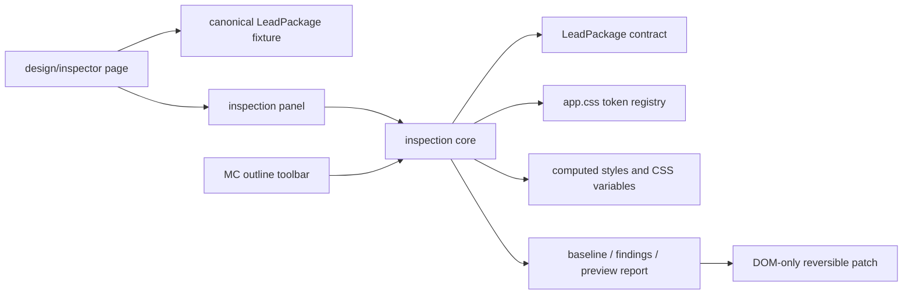
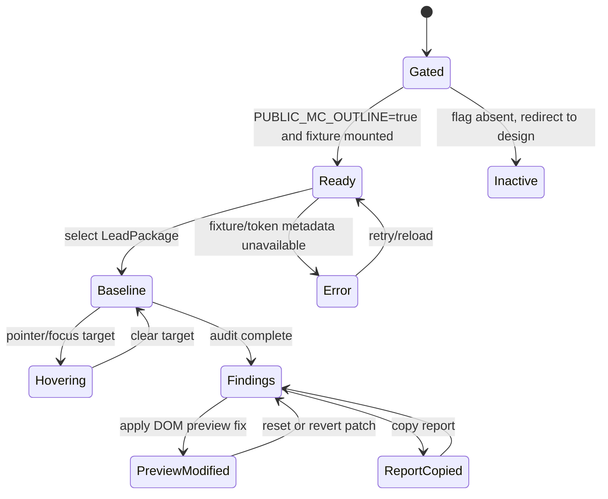

## Summary

Create a dedicated, internal design-engineering inspection page for `LeadPackage`. The page will render one canonical homepage fixture, expose a manually managed component tree, show token and custom-utility provenance on hover/focus, and produce a deterministic compliance report with DOM-only preview fixes.

The route is active only when `PUBLIC_MC_OUTLINE=true`. The existing outline toolbar remains available, but the dedicated page becomes the authoritative first inspection surface for LeadPackage; other components remain deferred.

---

## Problem Frame

The current MC toolbar inventories `.mc` roots and applies heuristic class checks, but it does not provide a stable LeadPackage identity, descendant ownership, computed-token provenance, or an auditable baseline/preview lifecycle. Several current findings are stale or context-blind: the curated `text-[0.9375rem]` fix does not match the current LeadPackage excerpt, `rounded-full` is intentional in TopicStrip, and global type-scale highlighting can include the inspector UI itself.

Design engineers need one controlled fixture where the active component, source context, token contract, findings, and preview changes are explicit and repeatable.

---

## Requirements

### Route and scope

- R1. Add a dedicated noindex inspection route under the design-system area, gated at build time by `PUBLIC_MC_OUTLINE=true`; when the flag is absent, the route must redirect to `/design` and expose no active inspector behavior.
- R2. Scope the first release to one canonical `LeadPackage` fixture using the same data and props as the homepage: `lead`, four `rows`, `feed`, `topics=[]`, `onAir=false`, and `flushTop`.
- R3. Keep source files immutable from the browser; all fixes are DOM previews with explicit reset and report history.

### Inspection and provenance

- R4. Let the engineer manually select the LeadPackage root and descendants through a stable component tree rather than selecting the first matching `.mc` instance globally.
- R5. Inspect text and component targets by pointer and keyboard focus, showing the target path, owning component, applied custom utility/classes, computed CSS properties, and the corresponding approved token or an explicit unclassified status.
- R6. Treat `src/styles/app.css` as the token authority and distinguish token utilities, approved custom utilities, structural utilities, deliberate exceptions, and unresolved drift. Unknown values must not be reported as clean.
- R7. Report findings by owner and descendant path, with severity, source/build context, rule identifier, evidence, and suggested resolution.

### Preview and reporting

- R8. Provide LeadPackage-specific preview fixes for known findings, including the current source-accurate arbitrary values and intentional exceptions; never auto-fix review-only findings.
- R9. Show a report lifecycle: idle, baseline, findings, preview-modified, reset, and final read-only report. Include applied preview IDs, unresolved findings, selected component/path, theme/viewport context, timestamp, and a copyable report representation.
- R10. Preserve progressive enhancement: the fixture remains readable when inspector JavaScript fails, and the page exposes clear loading, unavailable, empty, and error states.

### Accessibility and lifecycle

- R11. Make hover inspection keyboard-equivalent with focus-visible targets, Escape to clear/close, live report status, and stable ARIA relationships between tree nodes, selected target, and report details.
- R12. Reinitialize safely on Astro page lifecycle events, clear stale selection/highlights/report state on navigation, respect reduced motion, and keep the inspector UI outside the inspected component scope.

---

## Key Technical Decisions

- **KTD1. Use a dedicated canonical fixture, not arbitrary live-page capture.** The inspection page renders the homepage LeadPackage contract directly and marks its root with a stable inspection identity. This avoids duplicate-instance ambiguity, runtime page mutations, and reports that change because a news page has a different content mix.

- **KTD2. Keep the route build-gated and noindex.** `Layout.astro` already treats `PUBLIC_MC_OUTLINE` as a compile-time design-audit gate. The inspection route will redirect to `/design` when the flag is absent, remain absent from public sitemap/discovery, and expose no active controls in normal builds.

- **KTD3. Separate the inspection core from the current toolbar adapter.** Pure token registry, component contract, finding model, report state, and preview patch logic should be reusable by the dedicated page. The existing toolbar should consume the shared model without losing its current inventory role.

- **KTD4. Use a typed LeadPackage contract plus computed-style evidence.** A manual contract is required for component ownership, deliberate exceptions, and maturity status; CSS custom-property reads and computed styles provide runtime evidence. Heuristic class matching alone cannot prove compliance.

- **KTD5. Use stable structural identity.** Identify the fixture root and descendants by component name plus structural path/instance index, not by a DOM object or first matching component name. This allows reports and preview patches to survive re-rendering within the page while remaining local to the fixture.

- **KTD6. Make preview changes reversible and non-persistent.** A preview patch records `before`, `after`, rule ID, target path, and timestamp in memory. Reset restores the baseline snapshot; navigation discards all preview state. No browser-to-source write path is introduced.

- **KTD7. Treat intentional exceptions as first-class.** TopicStrip pills, Art’s aspect-ratio layout style, standard utilities such as `text-sm`, and other deliberate LeadPackage descendants must be marked as approved context rather than blanket violations. The report must distinguish approved exception, warning/review, and error/drift.

---

## High-Level Technical Design

### Component topology



The fixture owns the inspected scope. The core owns identity, token provenance, audit rules, report state, and preview patches. UI adapters render the same model in the dedicated page and the existing toolbar.

### Inspection state machine



The implementation should keep the static fixture usable in every state. A failed metadata fetch or CSSOM lookup produces an explicit finding or error state rather than silently treating the component as compliant.

---

## Scope Boundaries

### In scope

- One dedicated inspection page for LeadPackage.
- Canonical homepage data/props and the LeadPackage descendant tree: lead card, Art/Media, Kicker, ThumbRow stack, feed timeline, and optional-branch contract metadata.
- Token registry/provenance for the relevant `@theme` values, `:root` font/spacing variables, and custom utilities such as `headline-lead`, `headline-deck`, `caption-text`, and `row-meta`.
- Pointer and keyboard text/component inspection.
- Deterministic baseline report, DOM preview fixes, reset, and copyable report output.
- Minimal adaptation of the existing MC toolbar to link to or reuse the dedicated LeadPackage model.

### Deferred to Follow-Up Work

- Curated contracts and preview fixes for ShelfBand, VideoBand, OpinionBand, FeatureBand, SplitBand, and non-homepage components.
- Browser-driven source patch generation or direct file mutation.
- Comparing multiple LeadPackage contexts such as the design kitchen fixture versus the canonical homepage fixture.
- Persisting reports remotely or attaching them to CI/build artifacts.
- Broad automatic inference of every Tailwind utility or arbitrary class in the repository.

### Outside this product’s identity

- Public-facing component documentation or an end-user feature.
- Runtime authorization or user accounts; `PUBLIC_MC_OUTLINE` is a build-time developer gate, not security authentication.
- Editing production content or changing the homepage component behavior as part of inspection.

---

## System-Wide Impact

- `Layout.astro` remains the only global activation point for outline mode; the dedicated page must not add active inspector code to normal builds.
- The existing `McInspector` toolbar must continue to work on ordinary outline-mode pages, while excluding its own controls from component and type-scale inspection.
- Astro page lifecycle events require idempotent initialization and reset of module-level name/report state; cached SSR metadata must be scoped to the current page.
- The design-system source-of-truth order remains `AGENTS.md` → `src/pages/system.astro` → `src/styles/app.css`; older documentation examples that contradict current no-gradient/token rules must not be promoted into the LeadPackage contract.

---

## Risks and Dependencies

- **Stale contract risk:** current curated fixes are partly stale and must be rebuilt from the current LeadPackage markup before implementation is considered complete.
- **Provenance risk:** Astro strips `data-astro-source-*` from the live DOM; SSR path mapping is useful for context but must degrade explicitly when fetches fail or structural paths differ.
- **False-positive risk:** blanket rules incorrectly flag intentional TopicStrip radii, inline aspect-ratio layout styles, on-dark utilities, and standard utilities. Contract ownership and approved exceptions are required.
- **CSSOM/theme risk:** computed values differ under `.dark`, language changes, responsive breakpoints, and missing custom properties. Reports must record theme/viewport and show unresolved provenance when a value cannot be mapped.
- **Lifecycle risk:** Astro navigation and runtime re-rendering can leave stale highlights or selected nodes. Selection must use stable paths and clear on navigation.
- **Testing dependency:** Vitest currently runs in a Node environment with no browser DOM setup. Pure contract/report transitions belong in unit tests; pointer, keyboard, CSSOM, and responsive behavior require browser smoke verification unless a DOM test environment is intentionally introduced.

---

## Implementation Units

### U1. Define the gated LeadPackage fixture and inspection contract

**Goal:** Create the dedicated `/design/inspector` route and a manually managed LeadPackage contract that gives the inspector one stable, canonical target.

**Requirements:** R1, R2, R3, R4, R10.

**Dependencies:** None.

**Files:**

- `src/pages/design/inspector.astro` — create the gated noindex page and canonical fixture.
- `src/components/design/DesignShell.astro` — add the smallest optional `noindex` plumbing needed for the inspection route, without changing existing page defaults.
- `src/lib/inspection/lead-package.ts` — create typed component identity, descendant ownership, approved exceptions, maturity fields, and current LeadPackage fix/review rules.
- `src/lib/inspection/lead-package.test.ts` — test the contract and canonical data/prop shape.

**Approach:**

- Gate the page with the same compile-time flag used by Layout; when disabled, return a redirect to `/design` with no inspector controls or active client behavior.
- Render LeadPackage using the homepage data contract documented in `src/pages/index.astro` and `docs/homepage-patterns.md`.
- Mark the fixture with a stable inspection scope and expose a root/descendant path map that separates LeadPackage ownership from nested components such as TopicStrip and ThumbRow.
- Record deliberate exceptions and current source findings in the contract rather than deriving them only from class-name regexes. Reconcile the contract against the current component markup before preserving any existing curated fix.
- Keep the page noindex and omit it from public sitemap entries.

**Patterns to follow:** `src/components/design/DesignShell.astro`, `src/pages/design/kitchen.astro`, `src/components/kitchen/Spec.astro`, `src/pages/index.astro`, and the `Atom → Block → Band → Page` contract in `docs/design-system.md`.

**Test scenarios:**

- Homepage-equivalent props produce one identifiable LeadPackage root with the expected lead, four row, feed, topics, and on-air configuration.
- The disabled build path produces no active inspector control or fixture interaction.
- The contract identifies nested Art/Media, Kicker, ThumbRow, feed, and optional TopicStrip ownership without treating HeaderBar/OnAirNow as LeadPackage descendants.
- The contract marks TopicStrip pill radius and Art aspect-ratio style as intentional exceptions rather than errors.
- A missing optional topics branch produces a valid tree with no phantom TopicStrip finding.

**Verification:** The route is active only in outline builds, renders the same LeadPackage shape as the homepage, and exposes a stable fixture identity independent of the first matching global `.mc` root.

### U2. Build the token/provenance audit and report model

**Goal:** Replace heuristic-only LeadPackage auditing with a reusable, deterministic model that can connect classes and computed CSS values to approved tokens or explicit drift states.

**Requirements:** R5, R6, R7, R9, R10.

**Dependencies:** U1.

**Files:**

- `src/lib/inspection/token-registry.ts` — create the approved color, typography, spacing, radius, font-axis, and custom-utility registry backed by `src/styles/app.css`.
- `src/lib/inspection/audit.ts` — create ownership-aware finding extraction, CSS variable/computed-style provenance, severity classification, and report snapshots.
- `src/lib/inspection/audit.test.ts` — test deterministic findings, approved exceptions, unknown provenance, and report transitions.
- `src/lib/mc-inspector.ts` — refactor shared audit/scale/fix primitives to consume the new model without expanding generic curated fixes beyond LeadPackage.

**Approach:**

- Represent every inspected declaration as one of approved token, approved custom utility, structural utility, intentional exception, review warning, or unresolved drift.
- Read computed styles and relevant CSS custom properties under the active `.dark`/viewport state, but retain source class and contract evidence in every finding.
- Replace stale LeadPackage fix assumptions with source-accurate rules from the current component; include root-level matching and descendant ownership.
- Store a baseline snapshot before previews, an applied patch list, current findings, and reset/final report state. Reports are in-memory and copyable; no source mutation or persistence.
- Keep the generic toolbar’s existing behavior as an adapter over the shared model, excluding inspector DOM from inspected scopes and type-scale counts.

**Patterns to follow:** `src/styles/app.css` as the sole token source, `src/lib/mc-inspector.ts` audit concepts, `docs/sitemap-inventory.md` provenance/report structure, and `src/components/kitchen/Spec.astro` metadata attributes.

**Test scenarios:**

- Current LeadPackage markup and descendant findings are classified from the source contract; stale selector assumptions from the existing toolbar must not create a false clean result.
- TopicStrip `rounded-full` and arbitrary chip spacing are reported as approved or review-context findings when the contract says they are intentional, while an unapproved radius in the same scope remains a finding.
- Art’s inline `aspect-ratio` layout style is not misclassified as inline color/token drift.
- A root-level class violation is included in audit and preview matching.
- Unknown class/token provenance produces a warning or unresolved status, never a clean result.
- Dark/light theme and viewport changes update computed evidence without changing the source contract.
- Preview application records before/after values and reset restores the exact baseline snapshot.
- Missing CSS custom properties, failed SSR metadata, and malformed style declarations produce explicit error findings.

**Verification:** The same LeadPackage snapshot yields the same finding IDs and evidence ordering across repeated scans; reports distinguish source drift, intentional exception, preview change, and unresolved provenance.

### U3. Implement the dedicated inspection workspace and interaction state

**Goal:** Give design engineers a focused page for selecting LeadPackage descendants, hovering/focusing text, reviewing token provenance, and navigating the report lifecycle.

**Requirements:** R4, R5, R7, R8, R9, R11, R12.

**Dependencies:** U1, U2.

**Files:**

- `src/components/inspection/InspectionWorkspace.astro` — create the fixed/stacked inspector workspace UI using existing design-system shell patterns.
- `src/lib/inspection/inspection-page.ts` — create the page controller, stable selection model, hover/focus inspection, report rendering, preview/reset actions, and lifecycle cleanup.
- `src/lib/inspection/inspection-page.test.ts` — test state transitions and selection/report invariants without requiring a browser DOM.
- `src/components/McInspector.astro` — add the dedicated-page entry point only where it improves navigation from the existing toolbar.

**Approach:**

- Use a two-part page: the canonical LeadPackage fixture remains readable on the left/main surface; a tokenized inspection panel contains the component tree, target details, findings, and report controls.
- Start with LeadPackage as the manually active component; allow selecting its named descendants by stable path and instance index. Do not fall back to arbitrary first-match global selection.
- Hover and keyboard focus on text/component targets show a token popover with owner, source path, utility/class, computed property, CSS variable, value, and status. Inspector controls are excluded from the scope.
- Provide focus-visible tree controls, keyboard pick mode, Escape clear/close, `aria-live` report updates, reduced-motion behavior, and responsive stacking for narrow screens.
- Expose DOM preview fixes only for contract-approved LeadPackage rules. Show applied previews, remaining findings, reset, and copy-report actions; never imply that a preview changed source.
- Keep static content readable if JavaScript fails; the page should degrade to the rendered LeadPackage and explanatory copy.

**Technical design:** Directional state shape, not implementation code:

```text
scope: lead-package
selection: idle | root | descendant(path)
inspection: none | hover(target) | focus(target)
report: baseline | findings | preview-modified | reset | copied | error
preview: [] -> applied patch records -> reset to baseline
navigation: Astro page-load -> clear selection/highlights -> remount once
```

**Patterns to follow:** `src/pages/design/kitchen.astro` progressive filtering/`aria-live` behavior, `src/components/kitchen/Spec.astro` metadata shape, `src/components/design/DesignShell.astro`, and the existing reduced-motion/outline styles in `src/components/McInspector.astro`.

**Test scenarios:**

- Entering the page with the gate enabled selects the canonical LeadPackage root and shows baseline status.
- Selecting the root, a ThumbRow descendant, and a feed text target updates the panel to the matching stable path and never selects an unrelated `.mc` instance.
- Hover and keyboard focus show identical token details; leaving/clearing removes highlights and popovers.
- Applying a supported preview changes only the selected fixture, updates before/after evidence, and exposes reset.
- Reset restores the original classes/styles and finding counts.
- Copy-report output contains scope, path, finding IDs, provenance, preview patches, theme, viewport, and timestamp.
- Missing target, failed CSSOM lookup, SSR metadata failure, and empty fixture produce visible error/empty states.
- Astro page navigation clears stale selection and prevents duplicate event handlers.
- Reduced-motion and mobile layouts avoid animated jumps, clipped panels, or horizontal overflow.

**Verification:** A design engineer can enter the gated page, select LeadPackage or a descendant, inspect its token provenance, apply/reset a DOM preview, copy a report, and navigate away/back without stale state.

### U4. Integrate and harden the existing outline toolbar

**Goal:** Preserve the current toolbar while connecting it to the dedicated LeadPackage inspection model and removing known self-inspection/lifecycle drift.

**Requirements:** R1, R4, R6, R8, R12.

**Dependencies:** U2, U3.

**Files:**

- `src/lib/mc-inspector.ts` — consume shared registry/report/fix primitives, scope type highlights away from toolbar DOM, reset SSR name state on navigation, and expose a direct LeadPackage inspection link.
- `src/components/McInspector.astro` — update toolbar copy/status affordances without changing normal-build behavior.
- `src/lib/mc-inspector.test.ts` — test toolbar-facing model adapters and gate/idempotence behavior if the extracted core allows pure coverage.

**Approach:**

- Keep the toolbar’s Components/Type scales/Fix tabs as a lightweight page-wide inventory; the dedicated page is the authoritative LeadPackage workspace.
- Add an explicit “Open LeadPackage inspector” affordance when LeadPackage is selected instead of expanding generic toolbar fixes to every component.
- Reset page-scoped SSR names, selected elements, type highlights, and preview state on `astro:page-load`.
- Exclude `.mci-*` nodes and the dedicated page controls from `.mc` inventory and type-scale usage counts.

**Test scenarios:**

- Normal builds produce no active toolbar or dedicated inspector controls.
- Outline builds mount exactly one toolbar across initial load and `astro:page-load`.
- Selecting LeadPackage in the toolbar opens the dedicated route affordance and does not silently choose the first duplicate on the source page.
- Type-scale counts exclude toolbar samples and controls.
- Navigating between pages clears old names, highlights, and selected nodes.

**Verification:** Existing outline-mode inventory remains usable, generic components remain report-only, and LeadPackage inspection links to the stable dedicated fixture without regressions.

### U5. Document the LeadPackage inspection contract and verification surface

**Goal:** Make the inspection model maintainable and establish the first component’s maturity contract for future components.

**Requirements:** R2, R6, R7, R8, R9.

**Dependencies:** U1, U2, U3, U4.

**Files:**

- `docs/inspector.md` — document gate usage, LeadPackage scope, token provenance categories, report lifecycle, preview-only semantics, and how to add the next component.
- `docs/README.md` — link the inspector document in the design-system documentation index.
- `docs/component-stock.md` — update the marker/inspector relationship only if the final implementation changes the documented contract.

**Approach:**

- Document `src/styles/app.css`, `docs/design-system.md`, and the LeadPackage contract as authoritative sources.
- Record intentional exceptions and the distinction between source findings and DOM preview changes.
- Add a concise manual browser verification checklist for gated/ungated builds, selection, hover/focus inspection, preview/reset, copy report, dark mode, reduced motion, mobile, and navigation.

**Test scenarios:**

- Documentation names the exact gate, route, first supported component, preview-only behavior, and extension path for later components.
- Documentation does not claim that heuristic or preview-only findings mutate source or prove all repository compliance.

**Verification:** A new design engineer can enable the inspector, understand what a clean/warning/error report means, reproduce the LeadPackage flow, and add a future component contract without reading implementation internals first.

---

## Open Questions

- Whether the copyable report should use a stable JSON schema immediately or start as human-readable text with JSON deferred. The plan assumes a small stable JSON payload plus a readable panel.
- Whether the canonical fixture should later support a second context from `src/pages/design/kitchen.astro`. The first release uses only the homepage-equivalent fixture.

---

## Sources and Research

- `src/layouts/Layout.astro` — compile-time `PUBLIC_MC_OUTLINE` gate and global toolbar mount.
- `src/components/McInspector.astro` and `src/lib/mc-inspector.ts` — current toolbar, audit patterns, type-scale registry, and DOM preview behavior.
- `src/components/home4/LeadPackage.astro` — typed props and rendered descendant structure.
- `src/pages/index.astro` — canonical homepage LeadPackage data/prop contract.
- `src/pages/design/kitchen.astro` and `src/components/kitchen/Spec.astro` — live fixture metadata, progressive filtering, and `aria-live` patterns.
- `src/styles/app.css` — authoritative token and custom-utility source.
- `docs/design-system.md`, `docs/homepage-patterns.md`, and `docs/component-stock.md` — Atom → Block → Band architecture, LeadPackage layout, and `.mc` marker contract.
- `docs/sitemap-inventory.md` and `docs/superpowers/plans/2026-08-07-price-series-gold.md` — deterministic generated-audit/provenance patterns.
- No `docs/solutions/`, `STRATEGY.md`, or `CONCEPTS.md` exists in this repository. No external research was used because the repository already contains the relevant design-system and inspector patterns.
